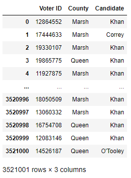
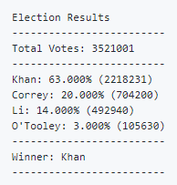
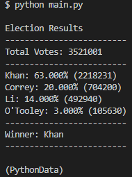
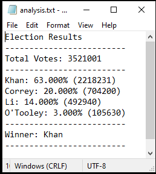

# Python Challenge
###### by Kurt Pessa

#### Setup
* Created a repository `python-challenge`
* Inside repository, created directories [`PyBank`](#pybank) and [`PyPoll`](#pypoll) for both challenges

## Challenges
1. ### [`PyBank`](#pybank)
2. ### [`PyPoll`](#pypoll) 

## 1. PyBank 

#### Setup
* Created a new python file `main.py` that is the main script to run for the analysis
1. Added a `Resources` folder that contains a CSV file `budget_data.csv`
2. Added an `analysis` folder that contains a text file with the results from the analysis

#### Given
* CSV file consisting of two columns:
	1. `Date`
	2. `Profit/Losses`

	 

### Tasks
1. The total number of months included over the entire period

	

	

2. The net total amount of "Profit/Losses" over the entire period

	

	

	* Verified calculation with pandas in a jupyter notebook

	

3. The average of the changes in "Profit/Losses" over the entire period

	

	
	
	* Verified calculation with pandas
	
	

4. The greatest increase in profits (date and amount) over the entire period
5. The greatest decrease in losses (date and amount) over the entire period	
	* Set up two variables (lists so I could keep track of both date and value) to track while csvreader is looping through data
	
	

	

	* Verified calculation with pandas
	
		

	* Looks similar to provided analysis
	
	

* In addition, your final script should both print the analysis to the terminal and export a text file with the results.

	

	

## 2. PyPoll 

* Given a set of poll data `election_data.csv` which was composed of three columns:
	1. `Voter ID`
	2. `County`
	3. `Candidate`

	

* Asked to analyze the votes and calculate each of the following:
	1. The total number of votes cast
		* Decided to initialize a counter variable and increment while progressing through CSV file.

		<pre><code>votes_counter = 0 
		for row in csvreader:
	    		 votes_counter += 1</code></pre>

	2. A complete list of candidates who received votes
		* Decided to initialize a dictionary `votes_dictionary` and while progressing through CSV file, if the `Candidate` already had a key in the dictionary, increment his/her vote count.  If not, initialize that `Candidate`'s vote count to 1.

		<pre><code>votes_dictionary = {}
		for row in csvreader:
		# row[2] is the Candidate's name .. ie. "Kahn"
		        if row[2] in votes_dictionary:
		            votes_dictionary[row[2]] += 1
		        else:
		            votes_dictionary[row[2]] = 1</code></pre>
		
	3. The percentage of votes each candidate won
		* Because I am unsure of how many candidates won votes, instead of hard coding a way to calculate percentages for each candidate, I instead looped through each key in the `votes_dictionary` and calculated the percentage won for each candidate by dividing the **votes for each candidate** (`votes_dictionary[key]`) by the **total number of votes** (`votes_counter`) and then multiplying by 100 to get a percentage. 
			* `percent_won = votes_dictionary[key]/votes_counter*100`
	
		<pre><code>for key in votes_dictionary:
			percent_won = votes_dictionary[key]/votes_counter*100 </code></pre>

	4. The total number of votes each candidate won
		* Keeping key's of the candidates and incrementing their votes in part 2 already kept track of the total number of votes each candidate won.

	5. The winner of the election based on popular vote
		* Decided to initialize a list `winner = [0,""]` because I wanted to keep track of a ***maximum*** value and also the candidate's name.

		<pre><code>for key in votes_dictionary:
			# if the current candidate's vote count is greater than winner tracker,
			if votes_dictionary[key] > winner[0]:	
				# reassign the winner vote count and candidate name.
				winner = [votes_dictionary[key],key]</code></pre>

* An example of how the analysis should look was given..

	

	* Decided to keep track of the print output by aggregating strings to a string variable `printStr`
	* Here's the code I ended up using to get desired output.
		* formatted the percentages to a float with 3 decimal places `percent_won:.3f`
	
	<pre><code>printStr = "Election Results\n"
    printStr += "-------------------------\n"
    printStr += f"Total Votes: {votes_counter}\n"
    printStr += "-------------------------\n"
    winner = [0,""]
    for key in votes_dictionary:
        percent_won = votes_dictionary[key]/votes_counter*100
        printStr += f"{key}: {percent_won:.3f}% ({votes_dictionary[key]})\n"
        if votes_dictionary[key] > winner[0]:
            winner = [votes_dictionary[key],key]
    printStr += "-------------------------\n"
    printStr += f"Winner: {winner[1]}\n"
    printStr += "-------------------------\n"
	
	print(printStr)</code></pre>

	* My results:

	

* In addition, your final script should both print the analysis to the terminal and export a text file with the results.
	* Used a context manager to write `printStr` variable to file
	
	<pre><code>outputfilepath = os.path.join("analysis",'analysis.txt')
	with open(outputfilepath,'w') as f:
	    f.write(printStr)</code></pre>

	* Result:
	
	

-----------
Thank you for making it to the end of this readme! =)