# Python Challenge
###### by Kurt Pessa

#### Setup
* Created a repository `python-challenge`
* Inside repository, created directories `PyBank` and `PyPoll` for both challenges

## PyBank

#### Setup
* Created a new python file `main.py` that is the main script to run for the analysis
1. Added a `Resources` folder that contains a CSV file `budget_data.csv`
2. Added an `analysis` folder that contains a text file with the results from the analysis

#### Given
* CSV file consisting of two columns:
	1. `Date`
	2. `Profit/Losses`

	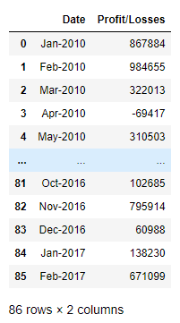 

### Tasks
1. The total number of months included over the entire period

	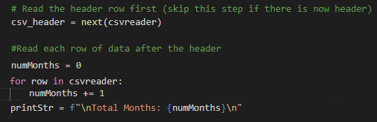

	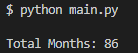

2. The net total amount of "Profit/Losses" over the entire period

	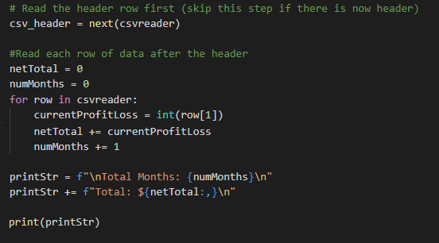

	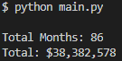

	* Verified calculation with pandas in a jupyter notebook

	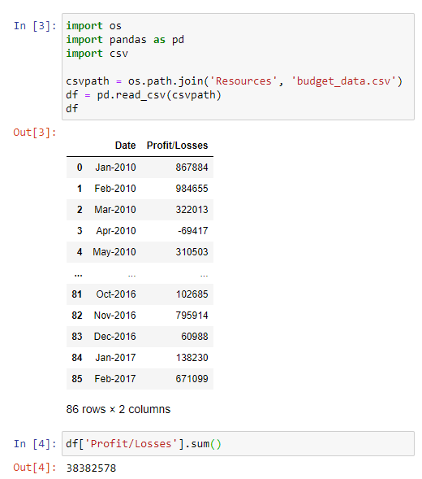

3. The average of the changes in "Profit/Losses" over the entire period

	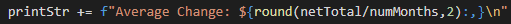

	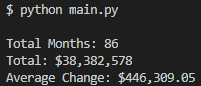
	
	* Verified calculation with pandas
	
	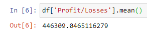

4. The greatest increase in profits (date and amount) over the entire period
5. The greatest decrease in losses (date and amount) over the entire period	
	* Set up two variables (lists so I could keep track of both date and value) to track while csvreader is looping through data
	
	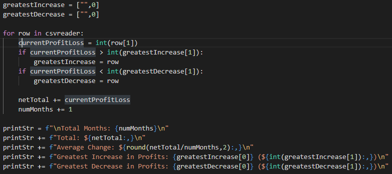

	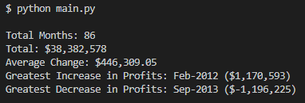

	* Verified calculation with pandas
	
	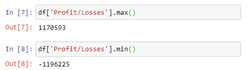	

	* Looks similar to provided analysis
	
	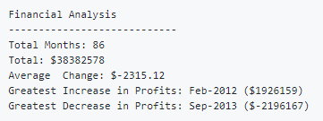

* In addition, your final script should both print the analysis to the terminal and export a text file with the results.

	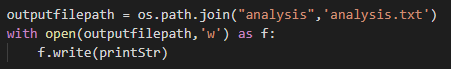

	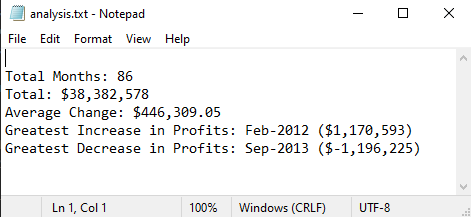